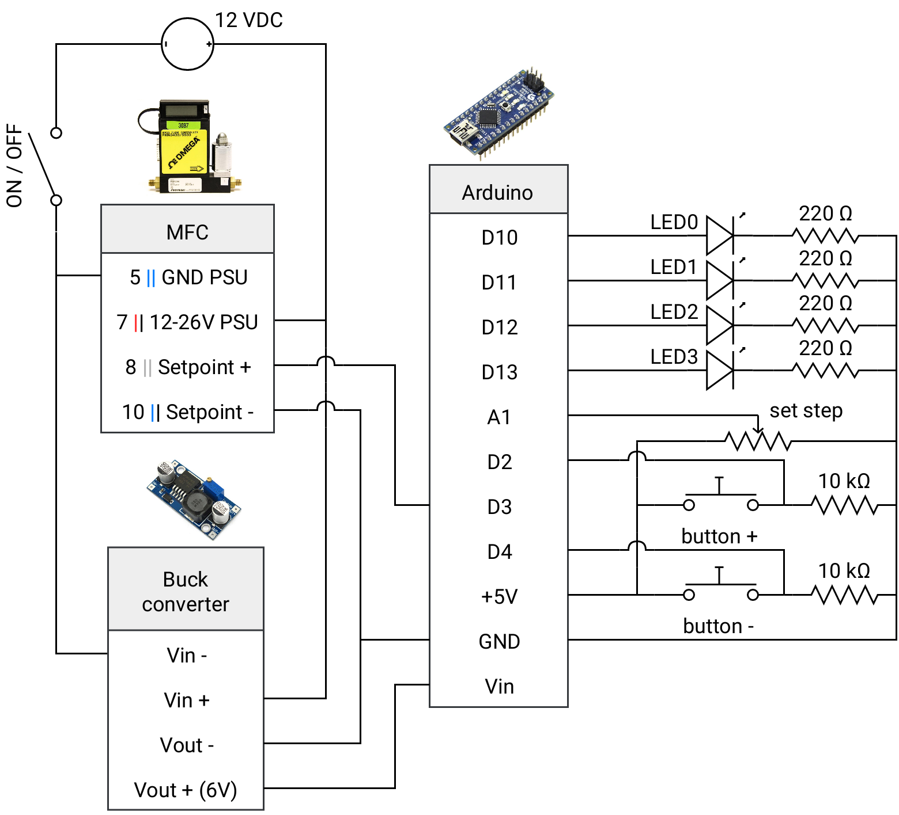

# MFC control

A device to remotely change the setpoint of Omega's Mass Flow Controllers. The flow value is set using +/- buttons. A potentiometer is used to set the amplitude of the buttons steps.

## Circuit

    

## 3d prints

[Onshape file](https://cad.onshape.com/documents/18eb6e605793d25ea773f81d/w/6521c0d1b9b9e777c69c406c/e/59e82885677739ed15fef912)
