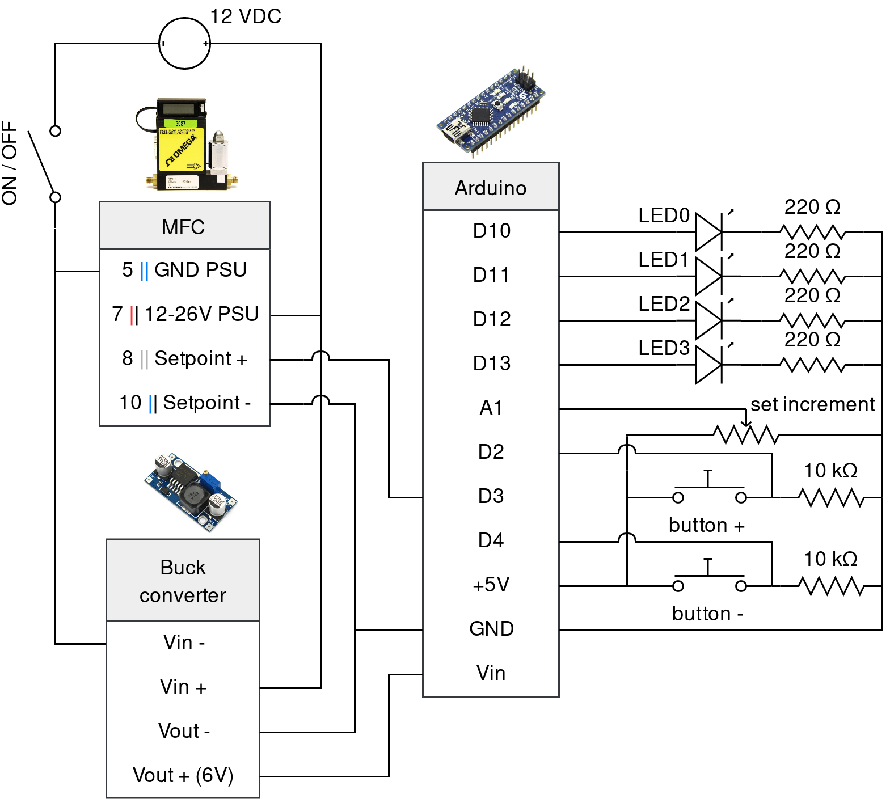

# Mass flow controller controller

 

  

    
  

  

    A device to remotely change the setpoint of Omega's Mass Flow Controllers. The flow value is set using +/- buttons. A potentiometer is used to set the amplitude of the buttons steps.
  

## Circuit

    

## CAD (3d printed case)

[Onshape file](https://cad.onshape.com/documents/919652335b20ed148a0a40ce/w/c5db6c015aa6b4d4c2422cc1/e/e19aaa403e4b71d81181d992)
